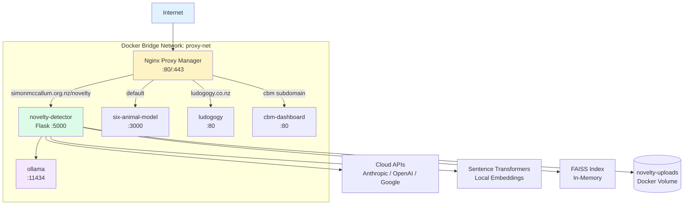
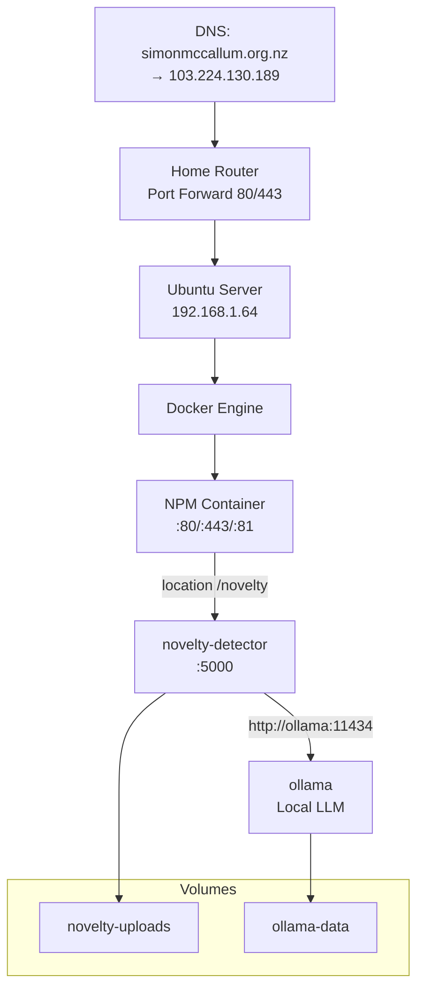
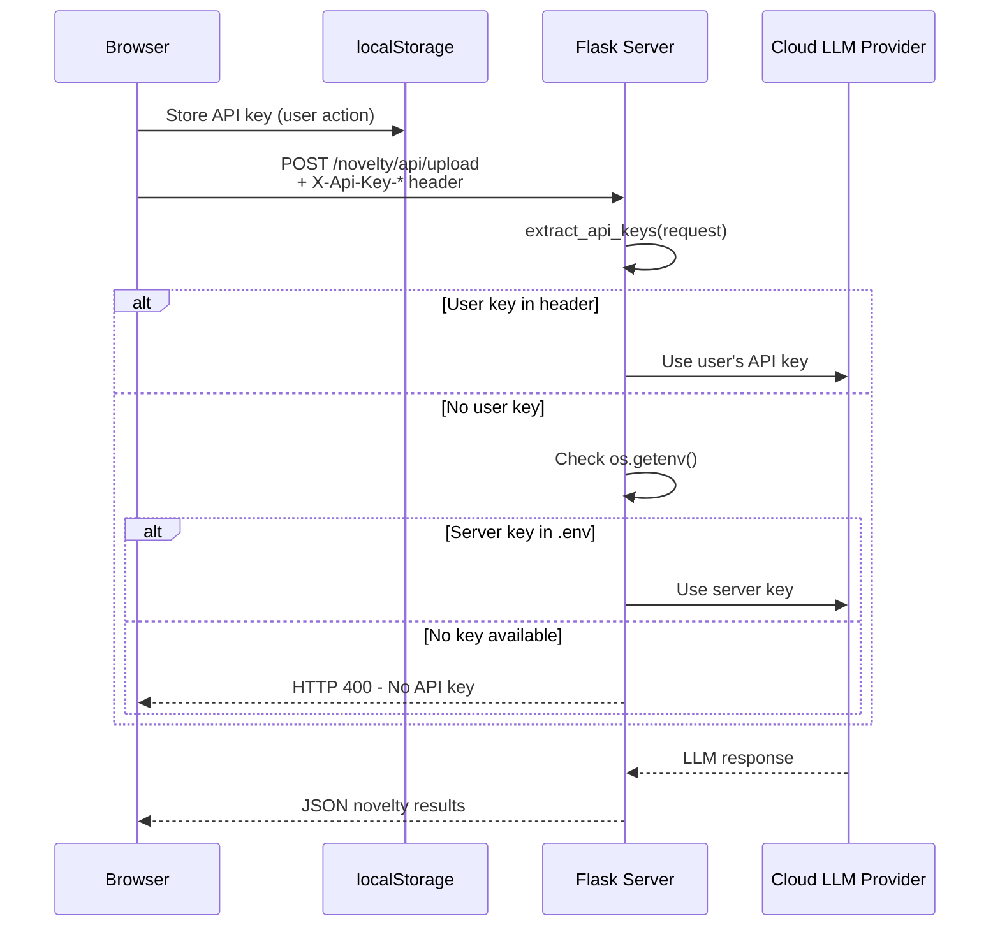
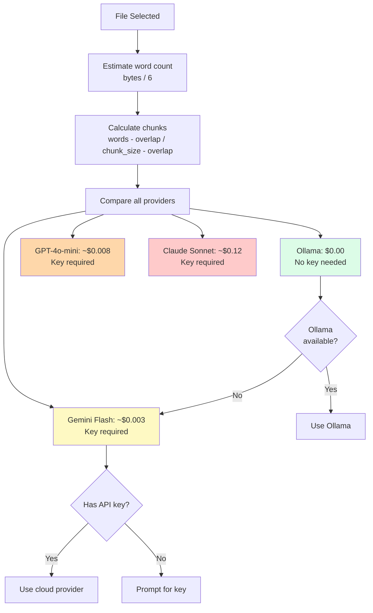

# PDF Novelty Detector — Architecture

## System Architecture



## Processing Pipeline

```mermaid
graph LR
    A[PDF Upload<br/>via browser] --> B[Text Extraction<br/>PyMuPDF/fitz]
    B --> C[Chunking<br/>~150 words<br/>20 word overlap]
    C --> D[LLM Compression<br/>Generate semantic prompts<br/>via Ollama/Cloud]
    D --> E[Embedding<br/>Sentence-BERT<br/>all-MiniLM-L6-v2]
    E --> F[L2 Normalize<br/>→ Cosine Similarity]
    F --> G[FAISS IndexFlatIP<br/>k-NN Search]
    G --> H[Novelty Scoring<br/>1 - avg_similarity]
    H --> I[Annotated PDF<br/>+ JSON Results]

    style A fill:#e0f2fe
    style D fill:#fef3c7
    style E fill:#f3e8ff
    style G fill:#ede9fe
    style I fill:#dcfce7
```



## Deployment Topology



## User API Key Flow



## Cost Decision Tree



## File Structure

```
novelty_detector/
├── server.py                 # Flask app with Blueprint at /novelty
├── novelty_detector.py       # Core analysis: LLM prompts + FAISS
├── pdf_processor.py          # PDF extraction, chunking, annotation
├── ollama_client.py          # HTTP client for Ollama API
├── cost_config.py            # Provider pricing and cost estimation
├── test_novelty_detector.py  # Test suite
├── Dockerfile                # Python 3.11 + gunicorn
├── requirements.txt          # Python dependencies
├── .env.example              # Configuration template
├── templates/
│   ├── base.html             # Tailwind layout with sidebar
│   ├── index.html            # Upload + config + results UI
│   ├── admin.html            # Provider status + API key management
│   └── about.html            # Algorithm explanation + Mermaid diagrams
├── static/
│   ├── js/app.js             # Frontend logic
│   └── css/custom.css        # Custom styles
└── docs/
    ├── architecture.md       # This file
    └── novelty_detection_theory.tex  # LaTeX academic paper
```
